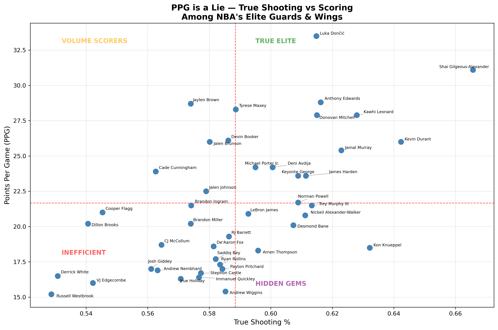
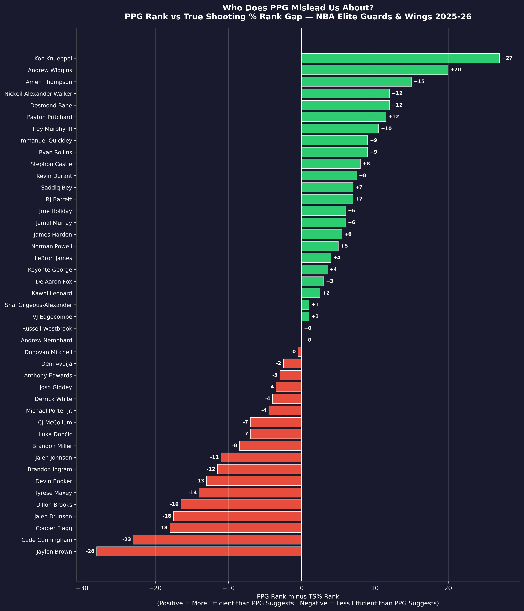

# PPG is a Lie
### Analyzing True Shooting Efficiency Among NBA's Elite Guards & Wings (2025-26)
## Motivation

While watching the 2025-26 NBA Finals, I noticed Jalen Brunson receiving enormous praise 
for his scoring performances despite poor shooting efficiency for most of the game. Because 
he finished with 30 points, casual fans crowned him the best player on the court, when in 
reality, Karl-Anthony Towns' offensive and defensive performance was the driving force behind 
the wins.

That got me thinking about shot chucking. Players like Jaylen Brown and Cade Cunningham came 
to mind, crafty self-creation scorers who are capable of getting their own shot anywhere on 
the floor. But are they actually efficient, or are they simply taking so many shots that to the 
naked eye they appear to be elite scorers?

This project set out to answer that question: are NBA's top guards and wings actually efficient 
scorers, or are they just taking enough shots that the box score hides their inefficiency?
## Methodology

### Player Selection

When thinking about efficiency, the first decision was removing big men from the analysis. 
A center taking 25 shots per game is a fundamentally different situation than a point guard 
taking 25 shots. Bigs are typically shooting layups, dunks, and shots near the rim, while 
guards and wings are creating off the dribble, pulling up from mid-range, and shooting off 
screens at a much higher degree of difficulty. For that reason, the analysis was limited to 
**Point Guards, Shooting Guards, and Small Forwards** only.

The second decision was focusing exclusively on stars. Role players simply do not have the 
offensive volume to make a shot chucking comparison meaningful, so the following filters 
were applied:

- **Position**: PG, SG, SF only
- **Minimum 50 games played**: to ensure a large enough sample size and exclude injury-shortened seasons
- **Minimum 15 PPG**: stars are scorers, this filters out defensive specialists and role players
- **Minimum 28 minutes per game**: ensures the player is a meaningful part of their team's offense

The combination of the scoring and minutes filters was intentional. There are players who 
log 30+ minutes per game averaging only 10 points, and there are players scoring 15+ points 
in limited minutes off the bench. Neither fits the profile of a primary offensive option. 
Together, these filters produced a final dataset of **43 elite guards and wings**.

### Efficiency Metric

Rather than using basic field goal percentage, this analysis uses **True Shooting Percentage 
(TS%)**, which accounts for two-point field goals, three-point field goals, and free throws 
in a single efficiency number.

**Formula: TS% = PTS / (2 x (FGA + 0.44 x FTA))**

The 0.44 multiplier accounts for the fact that a free throw trip uses approximately half a 
possession. TS% is the industry standard for measuring scoring efficiency in modern NBA 
analytics and is particularly relevant today given how deliberately players engineer trips 
to the free throw line as part of their offensive strategy.
## Key Findings

### 1. Cooper Flagg is Overrated (For Now)
One of the more surprising results was seeing Cooper Flagg land in the inefficient quadrant. 
For a player who won Rookie of the Year and received enormous praise, you would expect either 
efficient numbers or strong scoring volume given the minutes and ball handling responsibilities 
he took on. That said, context matters. Flagg had an unusually difficult rookie year, losing 
a key teammate to injury and trade, and was thrust into a primary star role far earlier than 
most rookies ever experience. He is not a bad player by any means, a great defender and a 
three level scoring threat with plenty of room to grow. But the data suggests there is a 
slight overrating conversation to be had heading into year two.

### 2. Amen Thompson is More Than a Defender
Amen Thompson is widely credited for his defensive ability, and rightfully so. But what the 
data reveals is that he is also quietly one of the most efficient scorers in this group, 
ranking 16th in TS% among all 43 players. He is not a high volume scorer, but he 
does not need to be. When you can defend at an elite level and score efficiently when called 
upon, you are a genuinely valuable player on both ends of the floor.

### 3. Kawhi Leonard is Still Elite
Despite being on the older end of his career and playing as a shooting forward rather than 
a traditional guard, Kawhi Leonard ranks third in this analysis behind only Shai 
Gilgeous-Alexander and Luka Dončić when combining both PPG and TS%. For a player his age, 
in his role, that level of efficiency and scoring output is remarkable and arguably 
underappreciated in the current NBA conversation.

### 4. The PPG Rank Gap Tells the Real Story
When comparing each player's PPG rank to their TS% rank, the biggest gaps reveal who the 
data misleads us about most. Jaylen Brown ranks 4th in scoring but 32nd in efficiency among 
this group. Jalen Brunson ranks 9th in scoring but 27th in efficiency. Devin Booker, often 
perceived as an efficient scorer, shows a significant gap between his scoring reputation and 
his actual efficiency ranking. On the other side, Kon Knueppel ranks 30th in scoring but 3rd 
in efficiency, making him the most underrated scorer in this dataset relative to his PPG.

## Visualizations

### Quadrant Analysis: True Shooting % vs PPG

### PPG Rank vs True Shooting % Rank Gap

## Tools Used

- **Python** — core programming language
- **Pandas** — data manipulation and filtering
- **NumPy** — regression calculations
- **Matplotlib** — data visualization
- **Seaborn** — plot styling
- **adjustText** — automatic label positioning on scatter plots
- **Data Source** — Basketball Reference (2025-26 NBA Per Game Stats)
- **IDE** — Visual Studio Code with Jupyter Notebook extension

## Limitations

- **Injury exclusions**: Players who appeared in fewer than 50 games were excluded regardless 
of ability. Notable players like Jayson Tatum, Draymond Green, Trae Young, and Jalen Williams 
are not represented in this analysis due to injury-shortened or limited seasons.

- **Position filtering**: By focusing on PG, SG, and SF only, elite big men like Nikola Jokić 
and Karl-Anthony Towns are excluded. Shot chucking and efficiency conversations are 
fundamentally different for big men given the nature of their shots.

- **Sample size variation**: Not all 43 players played the same number of games. The dataset 
includes players who appeared in anywhere from 50 to 82 games, meaning some players have 
larger sample sizes than others which can influence their averages.

- **TS% does not capture shot difficulty**: A player like Kon Knueppel, who generates a large 
portion of his attempts from wide open three point looks as an off-ball shooter, will naturally 
post a higher TS% than a player like Jalen Brunson, who has to work significantly harder to 
create separation and get to his spots. TS% measures outcomes, not the difficulty of the 
process used to generate those outcomes.

- **Regular season only**: This analysis uses regular season data only. Playoff performance, 
where defenses intensify and shot quality often declines, is not reflected here.
## Future Work

- **Player headshots on scatter plot**: Replace data points with each player's headshot image 
for a more visually engaging and immediately recognizable chart.

- **Playoff data comparison**: Pull playoff stats for the same 43 players and compare regular 
season TS% to playoff TS%. Who gets more efficient when it matters most, and who falls apart 
under pressure?

- **Include big men as a separate analysis**: Run the same quadrant analysis exclusively for 
centers and power forwards to see if the same shot chucking patterns exist among bigs.

- **Historical comparison**: Run this same analysis across multiple seasons to see if 
inefficient volume scorers improve over time or if the pattern is consistent throughout 
their careers.

- **Interactive dashboard**: Convert the visualizations into an interactive Plotly or Streamlit 
dashboard where users can filter by team, position, or season and explore the data themselves.

- **Defensive impact on offensive efficiency**: Analyze how elite team defenses affect 
opposing star players' TS% and PPG. For example, examining how Jalen Brunson's efficiency 
shifts when facing a defensive powerhouse like the San Antonio Spurs versus a weaker 
defensive team. This would add defensive context to the offensive efficiency conversation 
and help determine whether inefficient performances are a player flaw or a product of 
the opponent.
